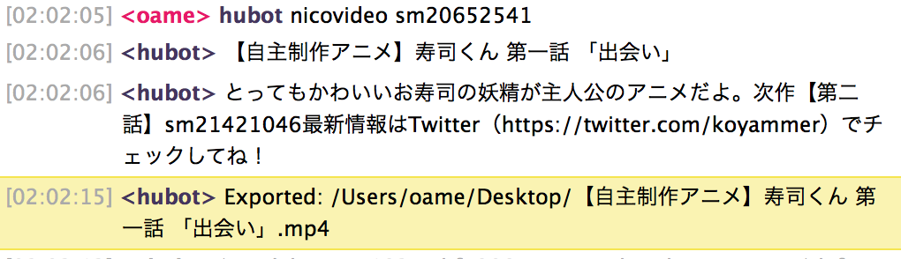

# hubot-nicovideo



## Usage

```
> hubot nicovideo [video_id]
```

### runner

```
### hubot-nicovideo
export NICOVIDEO_EMAIL=[email]
export NICOVIDEO_PASSWORD=[password]
export NICOVIDEO_FOLDER=[destination directory]
```